# pocket-tank 🐟

**A tiny language model keeps a fish tank alive on an $8 chip.**
This is a fork for the Waveshare **ESP32-P4-WIFI6-Touch-LCD-4B** - the
4-inch 720×720 ST7703 panel board (ESP32-P4, 16 MB flash, 32 MB PSRAM).

A 14-million-parameter transformer, distilled from a 26-billion-parameter
teacher, runs entirely on an ESP32-P4 microcontroller and makes every
high-level decision for a small aquarium of virtual fish: when to eat, hide,
explore, socialize, rest, or flee. No network. No cloud. The whole brain is a
7.56 MB file read straight from flash, and the tank lives on a 4-inch 720×720
panel you can hold in one hand.

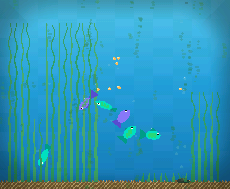

The fish aren't scripted. Each one periodically describes its situation to the
model as a single line of text (hunger, energy, fear, who's nearby, its own
personality) and the model completes the line with a goal and an urgency. A
reflex layer turns that goal into motion at 25 to 30 frames per second. When
the model isn't sure, the fish visibly *hesitates*.

```
zone 2 hunger 7 energy 5 stress 2 curiosity 8 bold 4 social 6 stage adult
trust 6 bored 3 food near 12 friend mid 3 bubble mid 10 reef far 7
wall clear last explore time day  ->  seek_food urgency 8
```

This repo is the complete project: the trained model, the distillation
pipeline that made it, a PC simulator, and the firmware for a real board.
Got the board? **[Install it from your browser](https://knoopx.github.io/pocket-tank-p4/)**,
no toolchain needed.

## Contents

- [The numbers](#the-numbers)
- [How it's put together](#how-its-put-together)
- [What the fish do](#what-the-fish-do)
- [The living tank](#the-living-tank)
- [Try it: PC simulator](#try-it-pc-simulator)
- [Try it: firmware in QEMU](#try-it-firmware-in-qemu)
- [Install from your browser](#install-from-your-browser)
- [Run it on real hardware](#run-it-on-real-hardware)
- [Train your own](#train-your-own)
- [Layout](#layout)
- [Documentation](#documentation)
- [Status](#status)

## The numbers

| | Teacher | Student (what ships) |
|---|---|---|
| Model | gemma4:26b | pocket-tank 14.3M (dim 384, 8 layers, 8 heads) |
| Parameters | ~26,000,000,000 | 14,300,000, about 1,818× fewer |
| Size | ~18 GB (Q4_K_M) | 57 MB fp32 → **7.56 MB 4-bit** |
| Vocabulary | ~262K tokens | **54 tokens** (a closed schema lexicon) |
| Runs on | A desktop GPU | ESP32-P4, from flash, no network |
| Agreement | | 72% picks the teacher's goal (the teacher agrees with *itself* 82%) |

On the real board a decision takes about 3.7 s at 12 tokens per second, with
the tank rendering at 25 to 30 fps alongside it on the other core. Trained on
51,613 teacher-labeled situations. Every measured number, learning curve, and
the methodology: [docs/stats.md](docs/stats.md).

## How it's put together

Three layers, strictly separated, all in `common/` and compiled unchanged
into both the simulator and the firmware:

- **Reflex layer** (`tank.c`). Physics, steering, schooling, touch gestures,
  feeding, the hunger economy, vegetation and algae. Runs every frame and
  never blocks on the model.
- **LLM advisor** (`llm/`). A llama2.c-style 4-bit inference engine, a
  word-level tokenizer, and one shared state encoder. Fish are re-asked only
  when their situation meaningfully changes, so four to six fish share one
  brain without anyone starving for a turn. The model runs on a core of the
  ESP32-P4 with quantized activations in internal SRAM (the P4 is RISC-V with
  no PIE SIMD, so the dot products are scalar); the weights are
  memory-mapped from flash and never copied.
- **Progression** (`progression.c`). The long game: growth, arrivals, trait
  drift, milestones, habits, persistence. Everything survives a power cut.

One deliberate rule: **the model owns its decisions.** There are no fallback
heuristics second-guessing it. If the model picks a goal, the fish commits.
Uncertainty shows up as visible hesitation, not a silent override. The reflex
layer only ever *performs* what the model chose, or stages presentations
(begging, courtship, greeting) that the model's own state has earned.

## What the fish do

Seven goals, from the browser prototype this project distills from:
`seek_food`, `follow_friend`, `inspect_reef`, `visit_bubbles`, `explore`,
`rest`, `dart_play`. (An eighth, `flee_shadow`, answered a roaming shadow
that was removed from the tank in September 2026; the token stays in the
vocabulary and the model was never taught to say it.) Each fish has five
drives (hunger, energy, stress, curiosity, boredom), three personality
traits (bold, sociable, lazy), a trust score toward you, and a life stage.
All of it is in the state line, so a bold fish and a shy one answer the same
situation differently, and the model was taught by example rather than by
rules.

**Boredom** is what keeps the tank moving. A fish that has been at the same
pastime for about a minute goes stale, and the model was taught that a bored
fish moves on, usually to explore a part of the tank it hasn't seen in a
while; a fresh fish keeps doing what it was doing. Before this the fish
would park at the bubble column, or follow each other in circles, for as
long as you cared to watch. Boredom never outranks hunger, and a bored fish
at night still rests.

The model samples its own distribution instead of always taking the top
answer. That restores the variety the teacher had and costs nothing on
survival: a starving fish picks `seek_food` 89% of the time at minimum across
every personality. When the top two choices are close, the fish pauses for a
moment before committing.

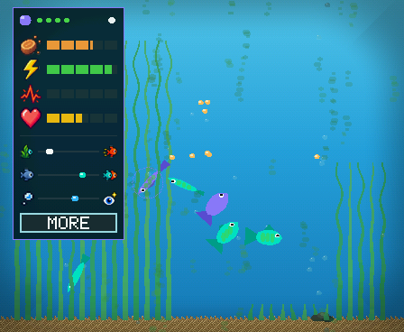

Tap a fish for its stats card. Needs, traits, and trust are revealed as the
fish shows that side of itself, so a new fish's card is mostly blank. The
MORE button at its foot (or a tap anywhere on the card) opens the milestones
page, where the SETTINGS and UPGRADES buttons live.

## The living tank

Everything below is detected from what actually happens in the tank, never
scripted, and it is all persisted.

**Growing up.** A new tank starts with two fry. Feed them and over days they
grow through juvenile, adult, and elder. A fry is plain; its markings come
in with its first growth spurt. Adults get a dorsal crest; elders
get bigger and settle down. Nothing announces it. Fish grow with time, lit
or not, and at a quarter speed while the tank sleeps; a stage reached in
the night is the morning's surprise.

**Arrivals.** Take good care of the pair and the tank earns more fish, up to
five, one at a time. Each arrival has conditions (trust, feedings, a fish
grown up, a hold-approach) and the tank *tells* you when it's close: the two
most trusting adults dive into the sea grass and circle low through it. Soon
after, at the next light-on, there's a fry in that grass. A bed has to be
tall enough to hide in before courtship starts or a fry can be born.

**Trust.** Hold a finger on the glass for three seconds and the fish that
trust you come over from anywhere in the tank, the most trusting first and
fastest. Rap three times and nearby fish scatter and stay spooked. Calm holds
earn trust, startles cost it, and the model reads trust as part of every
decision, so a fish that trusts you acts differently in every situation.

**Hunger.** A meal lasts five or six minutes awake. Left alone, the tank
drops a pellet only when someone is really hungry, so an untended tank hovers
between fed and peckish. Wake it after hours asleep and the school is
ravenous: they gather just under the surface where you usually feed them,
darting back and forth, and go into a frenzy when the pellets land. The tank
holds off feeding itself while they beg, so the first meal is yours.

**Upkeep.** The sea grass keeps growing, every frond on its own, right up to
the surface. A sideways stroke that starts on the grass cuts exactly the
fronds it crosses at the height of your finger; a sweep along the floor mows
a bed down to nubs. Algae films the glass over hours and a drag across it
squeegees it clean. Fish like cover: grass calms them, and only a tank truly
smothered by two beds at the ceiling stresses them.

**Milestones.** Tap MORE on the open stats card for the milestones page: a row per
fish with its sprite at its real size, its name and a growth strip, then a
badge for each first it has chosen to do: first meal from you, first
hold-approach, first reef, first bubbles, first follow, first dart. The
tank's row below tracks the population and the firsts you share: first
feeding, first trimming, first glass cleaning, first full night's sleep,
first play session, the tank changed someone. A locked badge is the same
picture as a gray silhouette; one earned since you last looked wears a
ring. Tap a badge to read it: a small panel with arrows at its top corners
that step through the rest of the group without going back to the page (a
fish's six badges, the tank's six, the fry's gates, or the fish themselves
from a fish's name); tap anywhere else to dismiss. At the foot of the
page: SETTINGS, UPGRADES (the shop) and CLOSE. The shop's and the settings
page's own CLOSE bring you back here, not out to the tank.

**The next fry.** While the tank can still grow, a NEW FRY row sits under
the last fish: what the next arrival needs, as badges that light up when
met, with a filling bar under each one still owed. The list is read from
the same rule that decides a birth, so it is never wrong: at two fish it
is trust, meals and a calm hold; later the youngest must grow up, and the
counts rise; and always clean glass and some grass, because no fry is
conceived in a dirty tank (film on more than 15% of the pane closes the
gate, and its bar fills as you wipe). Tap a badge for the plain words and where it stands ("ALL FISH
MUST HAVE TRUST OF AT LEAST 6 OUT OF 10 / LOWEST NOW 4.1"), and HOW? for a
tip on how to get there. Tap the name for the tally. When every step is
done, the fry is born at the next light-on.

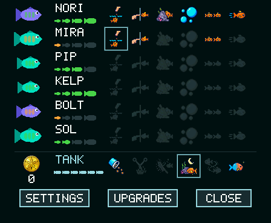
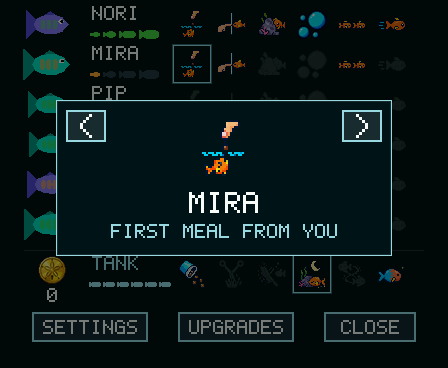
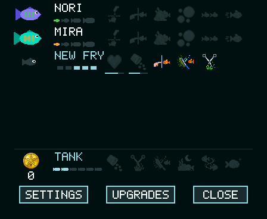
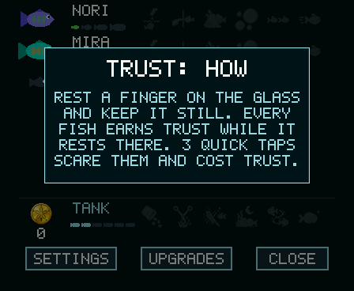

**Sand dollars.** Caring for the tank earns points, and the shop spends
them on things for the tank. A meal the fish eat from your hand pays 2; a
fish growing up pays 5, 10 and 25 for juvenile, adult and elder; a fry
born 20; a fish that comes to trust you completely 15; every hundred algae
colonies you wipe away and every hundred inches of grass you cut pay 25,
again and again. Nothing is ever needed and nothing is lost: a tank with no
sand dollars is exactly the tank there was before. The coin on the
milestones page's TANK row shows your balance, and it (or the UPGRADES
button) opens the shop: a row per item with its price, UNLOCK when you can
afford it, IN TANK once you own it, and HOW TO EARN for the list. Three
things to buy so far. The **sword plant** (40) is a fourth bed of broad
leaves on the open floor, trimmed and grown and counted as cover like the
grass. The **snail** (80) grazes the glass clean cell by cell, crawling
flat across the pane with its head leading, and walks the floor upright
when there is nothing to eat; it keeps working while the tank sleeps, so
the glass is thinner in the morning. It is drawn the way the fish, the
grass and the castle are, from a little geometry rather than a sprite, lit
from the upper left and tinted by the water of its row, and it moves like
a snail: waves run along its foot, its eye stalks sway, its shell rocks
with the crawl. Tap the snail for its card: a ring
around it and a tally of the spots of algae it has grazed clean so far,
night shifts included. The model sees neither: they reach
the fish the way your own chores do, through cover and the film. Dollars
earned while you watch show as a small "+N" over the water.

**Placing what you buy.** A plant is yours to put down. Right after you
unlock it the shop closes and a placement page comes up over the live
water, the same gesture as placing the bubble column: drag it left or
right along the floor and it follows your finger. A DEPTH bar sets where
it stands among the fish, and instead of words to decode it shows three
small pictures of your own first fish with two leaves, swimming over them,
through them, or behind them: BEHIND, AMONG or IN FRONT. The tank redraws
as you choose, a line under the bar says what to watch for, and DONE keeps
it. If you change your mind later, the plant's row in the shop has a MOVE
button that opens the same page again. The snail is not for placing; it
goes wherever the algae is.

**The castle.** The third thing in the shop (150) is a stone castle with
a swim-through arch: two pointed towers, a crenellated wall, a taller
rear tower, a brick arch and moss creeping up from a rubble base. It is
not a sprite. Like the fish and the grass it is drawn from a little
geometry every time the scene is built, its stone a brick pattern from a
position hash, lit from the upper left and tinted with the water of each
row, so it sits in the tank instead of on it. Its placement page has the
same drag and a DEPTH bar of two choices that mean the plant layer:
BEHIND puts it behind the grass and the fish, a ruin in the weeds; IN
FRONT stands it in front of the grass, which stops at its walls, and the
fish swim through the arch, tucked behind the jambs as they pass. The
fish do not know it is there. They find the arch by chance, which is most
of the charm.

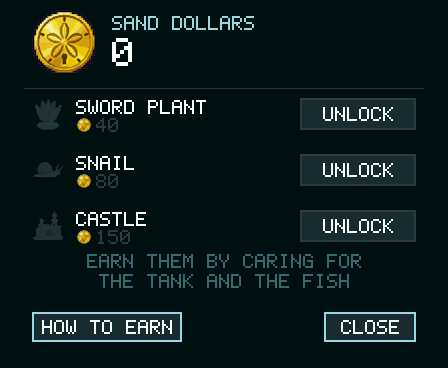
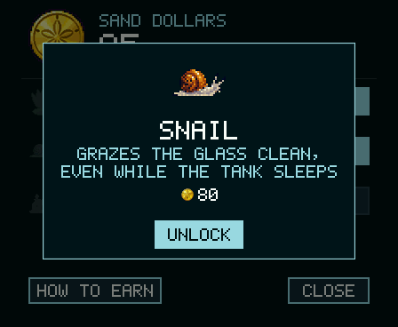
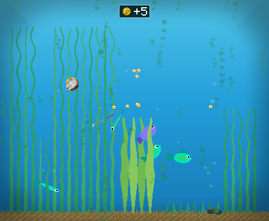
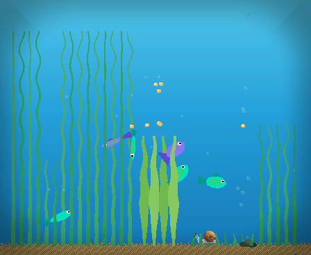
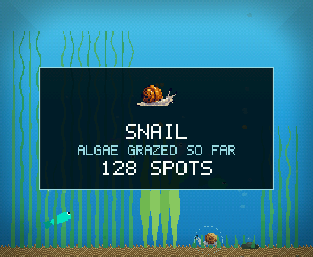
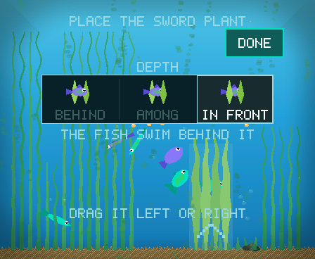
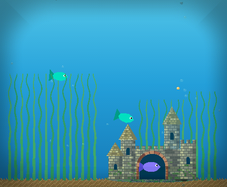
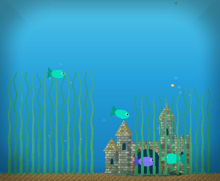
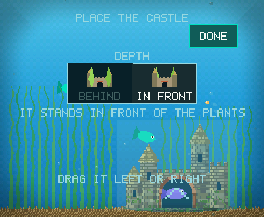

**The light.** Two quick taps on the glass turn the tank light off and on;
in the dark the fish rest and the palette dims. The settings page has a
LIGHTS OUT option, AUTO, that hands the light to the tank instead: it
knows when it is being handled (the motion sensor, or a touch) and goes
dark by itself after a chosen number of still seconds, so a tank left on
the desk is asleep until you pick it up. Six hours of device sleep in one
stretch earns the tank its first full night's sleep.

**Habits and continuity.** The tank remembers where you feed it and greets
the light coming on. The chip clock tells it how long it was off, so a tank
left dark for a day wakes hungry. One key does all of it: a short press on
BOOT puts the tank to sleep - it saves and the screen goes dark - and a
press wakes it. Press again within a minute and a half and the tank simply
resumes where it was; after that it drops into deep sleep, the fish having
lived through the time away: hunger up, energy back, the grass and the
algae grown, a long night ending in begging at the surface. The tank
decides how deep it sleeps; you never do. The 4B is USB-C powered and has no battery, no PMIC, and no power-off -
so deep sleep is the deepest state and the chip clock does not keep the
wall time across it. Hold BOOT and tap the
glass to reset the tank. The 4B has no IMU, so the screen is never
auto-flipped.

**First run.** A new tank, whether a fresh install or a reset, opens with a
short setup over the live water. A welcome page; then you place the bubble
column, dragging it left or right across the tank while the bubbles and
the airstone follow your finger; then each of the two fry in
turn: the fish being introduced swims a slow loop front and center with a
ring around it while you name it on an arcade-style letter wheel (touch a
slot, drag up or down to spin its letter, or tap the chevrons above and
below it), then you pick its body color from eight swatches and watch the
fry wear it. Its accent stays a question mark: a fry has no markings yet,
and they come in as it grows. A page of care tips finishes the tour. The
light stays on throughout, and the column, the names and the colors you
chose are saved with the tank.

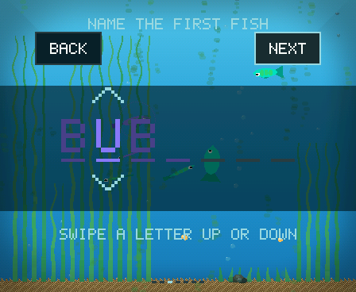

**A birth.** Every arrival is an event. The fry hatches low in the nursery
grass wearing its family's colors, the body of one parent and the markings
of the other, and the tank stops to introduce it. *A new fry!* rings the
newcomer wherever it is and names its parents; the next page is the same
letter wheel, so you name it; the last page shows the fry on its own, as it
is now, with what it inherited: whose body, whose markings, and how bold
and sociable it is on bars marked with each parent's own value. Its
markings, like any fry's, come in as it grows. The welcome is saved with
the tank until you finish it, so a fry born while you were away is waiting
for you at the next light.

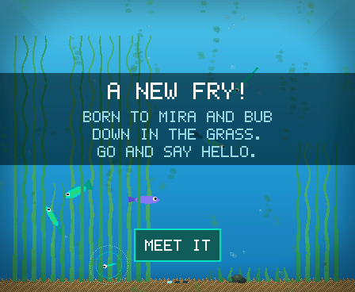
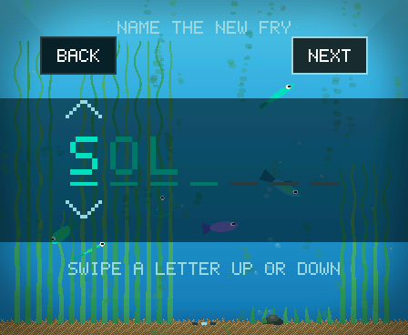
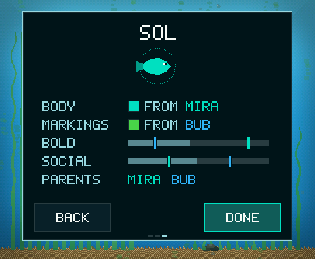

**Starting over.** Hold BOOT and tap the glass: a *Reset tank?* prompt
appears over the water with a NO and a YES. YES wipes the save and two new
fry take the tank, with the first-run setup to name them; NO, a sleep, or
twenty seconds of silence keep everything.

## Try it: PC simulator

The simulator runs the exact same `common/` code inside an LVGL + SDL2
window, with the shipped model as the brain. Needs SDL2 and LVGL v9 (cloned
in-tree):

```bash
git clone https://github.com/knoopx/pocket-tank-p4.git
cd pocket-tank-p4
git clone --depth 1 --branch v9.2.2 https://github.com/lvgl/lvgl.git sim/lvgl
brew install sdl2        # macOS; apt install libsdl2-dev on Linux
cd sim && make && ./fishsim
```

The Makefile targets x86_64 by default to match an Intel Homebrew SDL2; use
`make ARCH=` for a native build. The trained model
(`model/out/model_q4.bin` + `tokenizer.bin`) ships in the repo, so the LLM
brain works out of the box.

In the window, the mouse is your finger: tap the water surface or drag down
from the top edge to feed, click a fish for its stats card, click the card
(or its MORE button) for milestones, hold the button to rest a finger on the glass, three quick
clicks to startle, two to toggle the light, drag across the glass to wipe
algae, and stroke sideways through a bed to trim it. Keys: **F** feed at the
mouse, **N** light, **A** auto light, **H** handle the tank (moving the
mouse over the window counts too), **L** switch
between the rule stub and the LLM brain, **U** overlays, **M** milestones,
**4** the shop, **D** fifty sand dollars to try it,
**X** the reset prompt, **S** the first-run setup (or drops a birth's pages), **R** force an arrival
(the birth flow opens), **Z** jump through seven
hours of sleep, **G** grow the grass and algae now, **V** volume, **Q** quit.

Flags: `--fresh` starts a new random tank, `--fast N` runs tended time N×
faster so you can watch fish grow up, `--greedy` disables sampling,
`--narrate` prints every decision as it's made, `--snapshot <prefix>` writes
PPM frames of the tank, card, milestones page, the shop, the placement
page, the castle (in front, behind, its page), reset prompt, the setup
pages, and the three pages of a birth.

Headless checks, all of which run in CI-style without a window:
`--selftest` (reflex layer), `--selftest-llm [min]` (the real model),
`--selftest-pop` (arrivals, inherited looks, saves, the setup and birth flows), `--selftest-sleep` (sleep metabolism,
the deep-sleep wake, and ravenous begging), `--selftest-hunger` (the hunger economy),
`--selftest-tend` (grass, algae, trust holds), `--selftest-shop` (sand
dollars, the shop, the plant, the snail), and `--bench` (render cost).

## Try it: firmware in QEMU

The upstream project booted the app in Espressif's QEMU (the `esp32s3`
machine, octal 8 MB PSRAM emulated). That S3 harness is not in this P4
fork: the firmware here is built for the Waveshare 4B and runs on the
board, not the emulator.

## Install from your browser

The easy way onto a board: **https://knoopx.github.io/pocket-tank-p4/**.
It autodeploys: `.github/workflows/installer.yml` rebuilds the firmware, runs
`tools/make_installer.py` and pushes the assembled folder to the repo's
`gh-pages` branch on every push that touches `firmware/`, `common/`,
`model/out/` or `installer/` - so the page always offers the firmware of the
latest build. Plug the Waveshare board into your computer, open the page in
Chrome or Edge, click *Install Pocket Tank*, pick the port, and watch the bar
fill. About
8 MB goes over in a minute or two, the board reboots on its own, and two fry
are waiting.

**Updating is the same click.** The installer never erases the board: it
rewrites the app and the model, and the tank's save lives in a part of the
flash (NVS at `0x9000`) that none of the four parts cover, so your fish,
their names, trust, history, badges, sand dollars and decorations carry on.
Every version loads the saves of every earlier one (the save only ever grows
at the tail, and the one field that went in mid-struct is slid into place on
load). To start over, hold BOOT and tap the glass for the *Reset tank?*
prompt; the page also has an "erase and install fresh" button for a board
that won't get that far. The settings page shows the firmware version at
its foot, small and dim, so you can tell what you run. It is the same mechanism ESPHome and Home
Assistant use ([ESP Web Tools](https://esphome.github.io/esp-web-tools/)),
running entirely in the browser over Web Serial.

To host your own copy, `tools/make_installer.py` turns a firmware build plus
the shipped model into one static folder (`installer/dist/`: the page, a
manifest with the four parts and their flash offsets, the binaries, and the
flasher bundle, bun-installed from the pinned `esp-web-tools` package in
`installer/package.json`). Any HTTPS static host will do, GitHub Pages
included; [installer/README.md](installer/README.md) has the details.

## Run it on real hardware

The target is the Waveshare **ESP32-P4-WIFI6-Touch-LCD-4B** (ESP32-P4,
16 MB flash, 32 MB hex PSRAM, a 4-inch 720×720 ST7703 MIPI-DSI panel, GT911
capacitive touch, ES8311 audio, USB-C powered). The tank renders 448×368
landscape and is scaled to fill the square glass. The browser installer
above is the no-toolchain path; this is the developer one.

```bash
. ~/esp/esp-idf/export.sh
cd firmware && idf.py build
idf.py -p /dev/cu.usbmodem* flash
esptool.py --chip esp32p4 -p /dev/cu.usbmodem* write_flash 0x410000 ../model/out/model_q4.bin
```

The model lives in its own 8 MB raw partition (offset 0x410000) and only
needs flashing once.
[docs/bringup.md](docs/bringup.md) is the step-by-step checklist with pass
signals for each stage, and [docs/memory_budget.md](docs/memory_budget.md)
explains where every kilobyte goes. The boot log prints a per-stage frame
profile and per-decision inference timings, so performance work is
measurable without instruments.

**Other boards.** [knoopx](https://github.com/knoopx) ported the tank to the
Waveshare **ESP32-P4-WIFI6-Touch-LCD-4B** (4-inch 720×720 MIPI-DSI panel,
GT911 touch, ES8311 audio) in
[their fork](https://github.com/knoopx/pocket-tank). It is a community port:
it needs ESP-IDF 5.5, it is not built or tested here, and it may lag behind
this repo. [Pull request #5](https://github.com/mediacutlet/pocket-tank/pull/5)
has the details.

## Train your own

The whole distillation pipeline is here. `model/gen_traces.py` runs the
headless tank against any Ollama-served teacher and logs state→goal pairs;
`train_tokenizer.py`, `train.py`, and `export_q4.py` take it from JSONL to a
flashable 4-bit binary; `eval.py` measures agreement with the teacher on
fresh situations. It builds on a clone of
[karpathy/llama2.c](https://github.com/karpathy/llama2.c) in
`model/llama2.c/`.

Step-by-step commands: [docs/pipeline.md](docs/pipeline.md). Two things the
project learned the hard way, both documented there and in
[docs/stats.md](docs/stats.md): the teacher prompt is the DNA of the whole
dataset (one sentence moved a goal from 45% of labels to 14%), and a
seven-minute prompt check before an overnight run is always worth it.

## Layout

- `common/` — everything shared verbatim by sim and firmware: `tank.c`
  (reflex layer, the snail), `render.c` (RGB565 software renderer, stats
  card, milestones page, the shop, the reset prompt and its pixel font),
  `progression.c` (the long game, the sand dollars and persistence),
  `icons.c` (baked pixel art), `audio.c` (the sound mixer), `notice.c` (the
  milestone announcements), `llm/` (4-bit engine, word
  tokenizer, the shared encoder)
- `sim/` — the LVGL + SDL2 simulator, its persistence port, and the self-tests
- `firmware/` — ESP-IDF app: the display, touch and audio ports for the
  Waveshare 4B (the board has no battery, IMU, or external RTC), the
  on-device advisor scheduler, and the partition table
- `model/` — the frozen [state/goal schema](model/schema.md), trace
  generation, training, evaluation, probes, and the 4-bit export
- `installer/` — the browser installer page; the ESP Web Tools flasher is
  not kept in the repo, it is bun-installed from the pinned `esp-web-tools`
  package (`installer/package.json`); `tools/make_installer.py` assembles the
  upload folder, which the Actions job publishes to the repo's `gh-pages`
  branch (GitHub Pages)
- `tools/` — the icon baker, the sound bank builder, the installer
  assembler, and a serial bench client
- `assets/icons/` — the pixel-art source for the stats card, the badges,
  the shop and the snail
- `assets/sounds/` — the cues (16 kHz mono) and their levels

## Documentation

- [docs/stats.md](docs/stats.md) — every measured number, dated
- [docs/pipeline.md](docs/pipeline.md) — teacher to flashable binary
- [model/schema.md](model/schema.md) — the state encoding and goal output
- [docs/progression.md](docs/progression.md) — the progression contract:
  growth, hunger, trust, upkeep, sleep, breeding
- [docs/progression-next.md](docs/progression-next.md) — the design and the
  evidence behind it
- [docs/retrain-v3.md](docs/retrain-v3.md) — the schema v3 retrain runbook
- [docs/retrain-v4.md](docs/retrain-v4.md) — the schema v4 (boredom) retrain runbook and its numbers
- [docs/DEVICE.md](docs/DEVICE.md) — what is in flight on the device, and the flash rule
- [docs/AUDIO.md](docs/AUDIO.md) — the sound design: the cues, the asset pipeline, the power rules
- [docs/memory_budget.md](docs/memory_budget.md) — flash, PSRAM, and SRAM plan
- [docs/bringup.md](docs/bringup.md) — hardware bring-up checklist

## Status

- ✅ Model: schema v4 (boredom, no shadow), 14.3M student, 4-bit export, evaluated
- ✅ Simulator: the full tank with progression, self-tests, snapshots
- ✅ Firmware: running on the real 4B board at 25 to 30 fps and 3.7 s per
  decision, with touch, the ES8311 speaker, and one key (BOOT) for sleep
  and wake (a 90 s nap window, then deep sleep)
- ✅ The living tank: growth, arrivals with courtship, trust, the hunger
  economy, upkeep chores, milestones, the reset prompt, the first-run setup
  (place the bubbles, a letter wheel to name each fry, a body color to pick),
  births announced and named with a family page, a sleep that lives
  through the night at the next boot, fish that get bored and go exploring
- ✅ Sound: the board's own little speaker plays cues for what you do (a
  feed, the light, a trim, a card) and for the fish (eating, a spook, a
  fish coming to your finger), plus a welcome, a birth fanfare and
  milestone chimes with an on-screen announcement; the codec is only
  powered while the tank is in your hands (the touch keeps it warm); a
  settings page (from the milestones page) for brightness and volume, with
  a mute
- ✅ The light follows the hand: an optional idle rule (touch) puts a tank
  left on the desk to sleep; the double-tap by default
- ✅ Sand dollars: care earns points, the shop spends them; a sword plant,
  an algae-grazing snail and a swim-through castle to start; what you buy you place yourself,
  where along the floor and whether it stands behind, among or in front
  of the fish
- ✅ Browser installer: one click from Chrome or Edge, autodeployed to the
  repo's GitHub Pages on every qualifying push
- ✅ Power: the 4B is USB-C powered (no battery, no PMIC); its sleep is deep
  sleep, and the tank's own log tracks it. What is in flight and how to
  pick it up is in
  [docs/DEVICE.md](docs/DEVICE.md)
- 🚧 Next: more to unlock: new fish species, more plants, corals, and more
  tank maintenance critters (urchins to keep the grass down)
- 🚧 Next: more achievements and milestones

## The video series

This repo is the companion to a YouTube series documenting the build:
distilling the model, designing the schema, squeezing inference into PSRAM,
first boot on real glass, and the tank growing into a pet.

**▶ Watch:** https://youtu.be/C2z7x47xxdM

## License

MIT, see [LICENSE](LICENSE). `model/llama2.c/` and `sim/lvgl/` are cloned
separately and carry their own MIT licenses.
